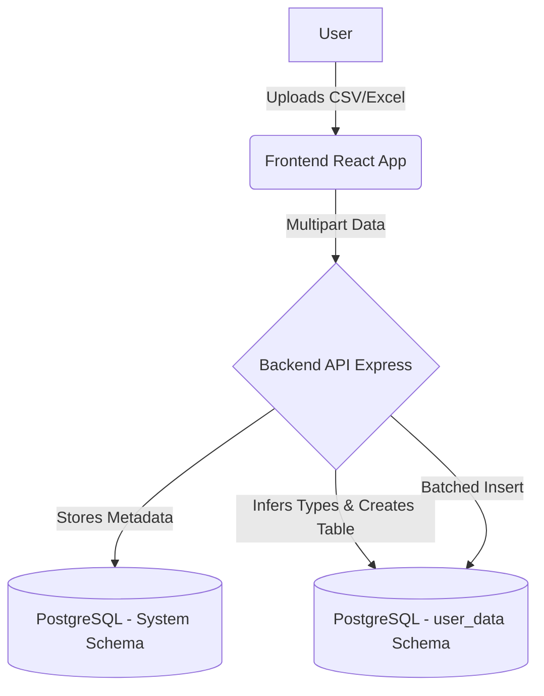
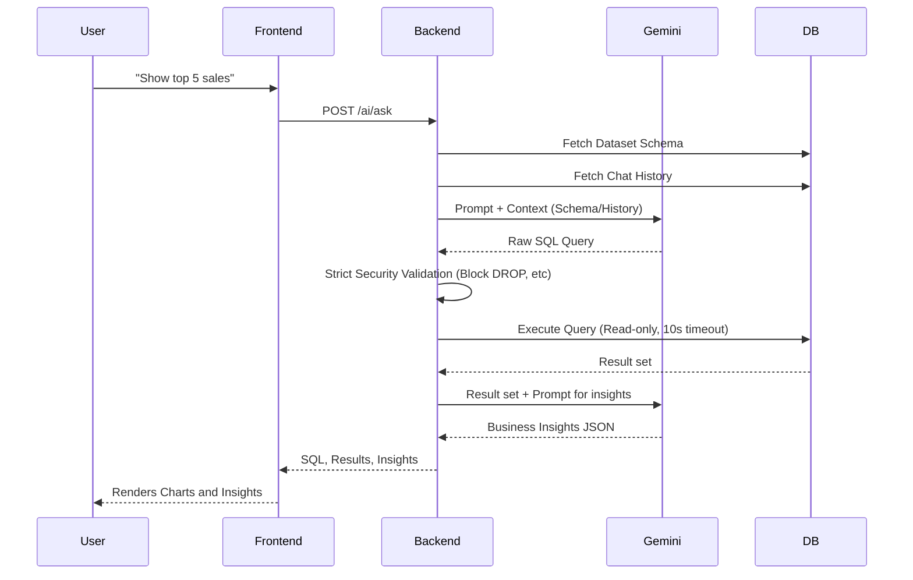

# System Architecture

## Component Flow

## AI Query Flow

## Security Design Decisions
- **Schema Isolation**: User data is placed in the `user_data` namespace, strictly separate from the application's configuration tables.
- **SQL Sanitization**: Regex blocking of all mutating SQL keywords (`DROP`, `DELETE`, `ALTER`).
- **Parameterized Config**: `DATABASE_URL` and keys are managed via environment variables.

## Caching Strategy
Currently implemented as fast in-memory stores via Prisma Client query caching.
